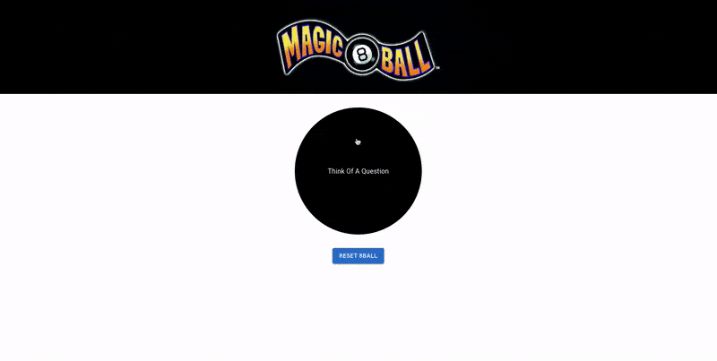

# Eightball App

This is a React app built with Vite that randomizes an Eightball answer, along with a matching color.

This uses `useState` to update the colors and message on click.



### Installation and setup

To install, and get the app up and running:
```shell
npm install
npm run dev
```

This will run the app on `localhost:3000`